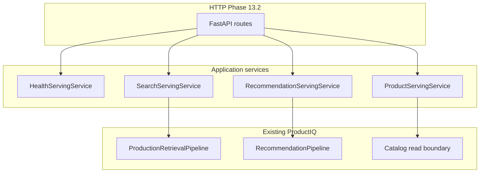

# Phase 13.1 — API & Serving Architecture

**Status:** Contract and architecture; FastAPI foundation in Phase 13.2 (`src/productiq/api/`)  
**Implements:** Serving boundary, public API schemas, service protocols, error mapping  
**Defers to Phase 13.3+:** Search/recommend/product routes, real readiness probes, pipeline wiring

## Purpose

Phase **13.1** defines how ProductIQ will be exposed online without moving retrieval, ranking, recommendation, or evaluation logic into HTTP handlers.

The serving layer is a **thin orchestration boundary**:

```text
Client (future Next.js / other)
        ↓
FastAPI (Phase 13.2)
        ↓
Pydantic API schema validation
        ↓
Application service (SearchServingService, …)
        ↓
Existing ProductIQ pipelines
        ↓
API response mapping (Phase 13.1 mappers)
        ↓
JSON response
```

**FastAPI route ≠ business logic.** Routes validate HTTP, resolve dependencies, call services, map errors.

## Why this layer exists

| Concern | Domain (Phases 3–12) | Serving (Phase 13+) |
|---------|----------------------|---------------------|
| Query understanding | `QueryRepresentation` | Accept raw `query` string; build representation in service |
| Retrieval / RRF | `ProductionRetrievalPipeline` | Injected pipeline; not in routes |
| Ranking | Baseline ranker (production) | Via `retrieve_ranked` / ranked search |
| Recommendations | `RecommendationPipeline` | SIMILAR only in production API |
| Evaluation | Phase 12 artifacts | **Out of scope** for public API |
| Errors | `ProductIQError` hierarchy | `ApiErrorEnvelope` |

## Versioning

- URL prefix: **`/api/v1`** (`SERVING_API_ROUTE_PREFIX`)
- Major version in path; breaking HTTP contract changes require **`v2`**
- Domain contract versions (ranking, recommendation, evaluation) remain internal

## Planned endpoints (Phase 13.2)

| Method | Route | Service |
|--------|-------|---------|
| GET | `/api/v1/health` | `HealthServingService.health()` |
| GET | `/api/v1/ready` | `HealthServingService.ready()` |
| POST | `/api/v1/search` | `SearchServingService.search()` |
| POST | `/api/v1/recommendations` | `RecommendationServingService.recommend()` |
| GET | `/api/v1/products/{product_id}` | `ProductServingService.get_product()` |

Constants: `PLANNED_ROUTE_*` in `productiq.serving.versioning`.

## Dependency injection



**Production:** factory/build at startup (similar to `create_production_retrieval_pipeline_from_retrievers`) injects real pipelines into service implementations.

**Testing:** route tests use fake services implementing the same `Protocol`s; domain tests remain unchanged.

## Configuration boundary

| Layer | Module | Examples |
|-------|--------|----------|
| Core app | `productiq.config.settings.Settings` | `DATABASE_URL`, `APP_ENV`, logging |
| Serving | `productiq.serving.config.ServingConfig` | `PRODUCTIQ_API_MAX_TOP_K`, service name |

Deployment host/port, Uvicorn, Docker — **not** in Phase 13.1.

## Health vs readiness

| Endpoint | Semantics | Phase 13.1 |
|----------|-----------|------------|
| **health** | Process alive; cheap | `HealthResponse(status=ok)` — no DB/index/model I/O |
| **ready** | Able to serve traffic | Contract allows dependency checks; **no expensive probes yet** |

Future readiness checks may include PostgreSQL, BM25 index, embedding model, vector index, LTR artifact (experimental only).

## Error lifecycle

1. Domain raises `ProductIQError` (or `ValueError` from API schema).
2. Service layer propagates (no silent swallow).
3. HTTP layer calls `map_exception_to_api_error(exc, request_id=…)`.
4. Client receives `ApiErrorEnvelope` — **no stack traces**.

See `docs/architecture/api-serving-contract.md` for codes and JSON shape.

## Request lifecycle (search example)

```text
POST /api/v1/search
  → SearchApiRequest validated (query, top_k, optional QueryFilterConstraints)
  → SearchServingService.search()
       → normalize/build QueryRepresentation (13.2)
       → RetrievalRequest + ProductionRetrievalPipeline.retrieve_ranked()
       → ranked_search_to_api_response()
  → SearchApiResponse JSON
```

Filters reuse **`QueryFilterConstraints`** — no parallel filter system.

## Deliberately out of scope (Phase 13.1)

- FastAPI app, routers, middleware, OpenAPI deployment
- Redis, caching, auth, rate limits
- Next.js, Docker, CI deploy
- Personalized / complementary recommendations in API
- LTR in production search path
- Phase 12 evaluation HTTP endpoints

## Package layout

`src/productiq/serving/`

- `versioning.py` — `/api/v1` constants
- `config.py` — serving settings
- `errors.py` — public error envelope + exception mapping
- `health.py` — health/readiness schemas
- `search_schema.py`, `recommendation_schema.py`, `product_schema.py` — public contracts
- `mappers.py` — domain → API projections
- `protocols.py` — service interfaces for DI

## Related docs

- `docs/architecture/api-serving-contract.md` — request/response fields
- `docs/architecture/production-retrieval-pipeline.md` — search backend
- `docs/architecture/recommendation-pipeline.md` — recommendation backend
- Notebook: `notebooks/data_engineering/66_api_serving_contract.ipynb`
